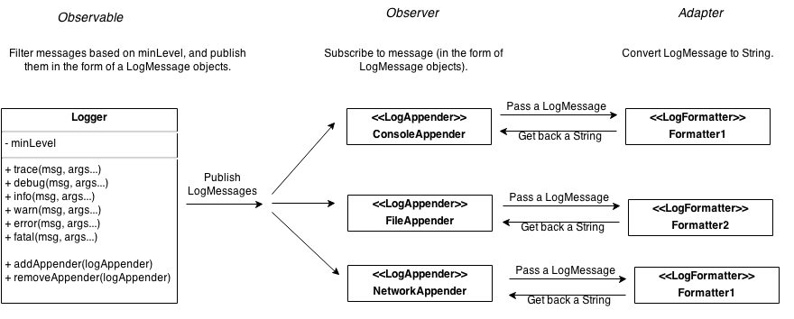

# Logging Example

Based on our new requirement, we realize that there are 3 different responsibilities:
 * Filter log messages based on their level.
 * Writing/appending log messages to different destinations (e.g. console or file).
 * Formatting a log message.

We add the following components to our design:
 * The [`LogMessage`](src/csc301/loggingExample/logging/LogMessage.java) class - An (unformatted) message, with additional meta-data such as timestamp and level.
 * The [`LogFormatter`](src/csc301/loggingExample/logging/LogFormatter.java) interface - A contract for any class that can convert a `LogMessage` to a string.

Our system architecture is much more flexible, and looks like this:

 
