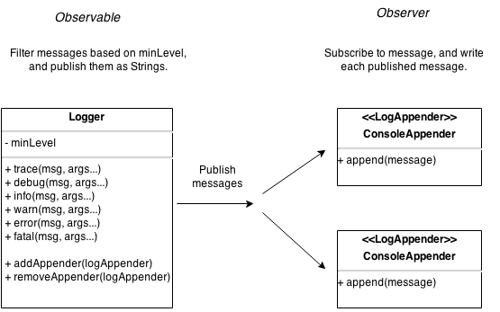

# Logging Example

In this step, we apply the Observer design pattern that we learned last week, and end up with an architecture that looks like this:

__New Requirement:__ We would like messages to be printed in different formats.    
For example, we may (or may not) want to include a timestamp, we may (or may not) want to include the log level, etc.

Let's see how we satisfy this requirement in [step 9](https://github.com/csc301-fall2014/LoggingExample/tree/step9).
